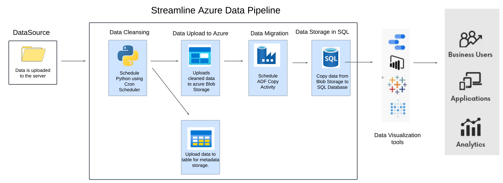
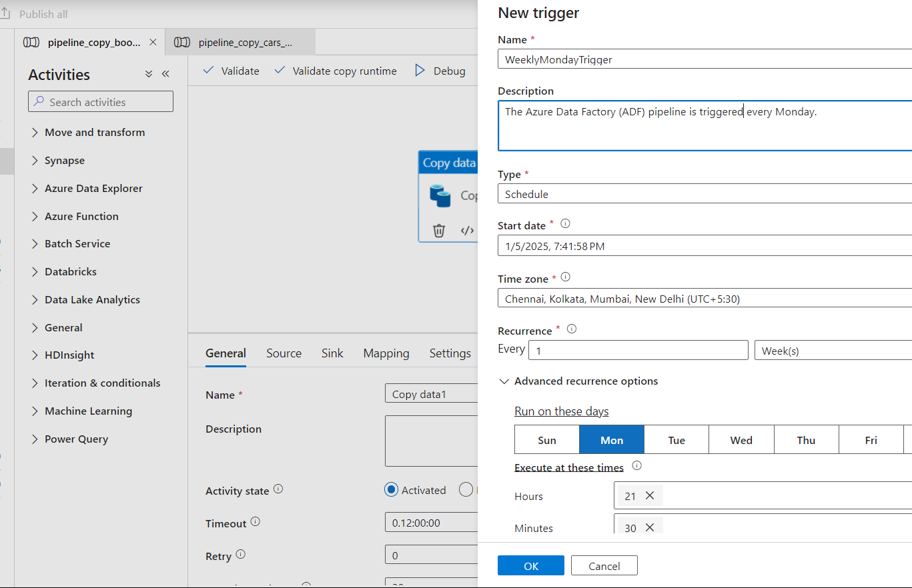
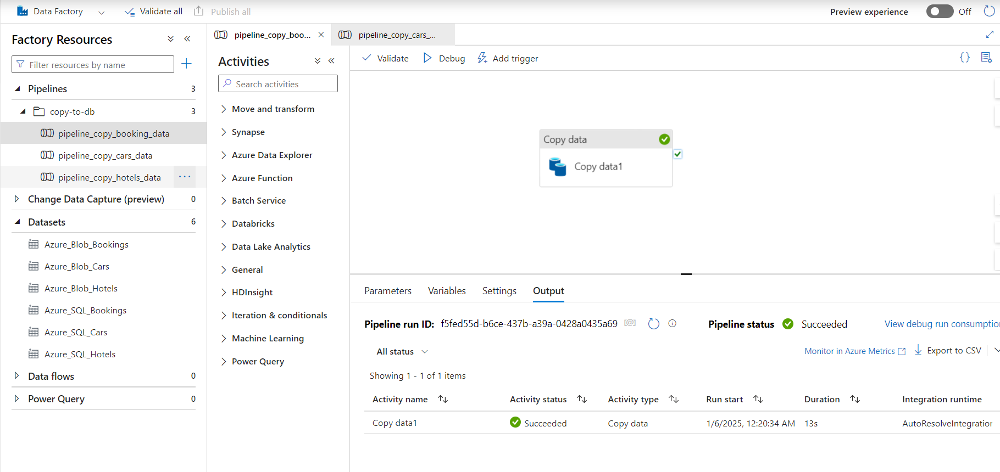
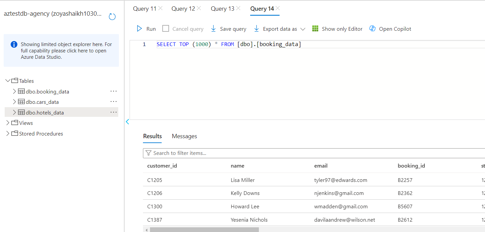

# Streamline Azure Travel Data Pipeline
## Overview
This project automates the process of cleaning agency data, uploading the cleaned data to Azure Blob Storage, and using Azure Data Factory (ADF) to orchestrate the movement of the data into an SQL database. Metadata about the processed data is stored in Azure Tables for efficient tracking and querying.

The pipeline ensures that agency data is cleaned and processed regularly, making it easily available for downstream applications such as analytics, reporting, and machine learning.



## High-Level Architecture
**Data Upload to Server:** Files are uploaded by agencies to a central server.

**Data Cleaning:** The uploaded data is processed and cleaned using Python scripts.
**Upload to Azure Blob Storage:** Cleaned data is uploaded to Azure Blob Storage for long-term storage.

**Data Movement with ADF:** Azure Data Factory (ADF) is used to automate the movement of cleaned data from Blob Storage into an Azure SQL Database for querying and reporting.

**Metadata Storage in Azure Tables:** Metadata related to each upload (e.g., filename, processing status) is stored in Azure Tables for tracking and querying.

## Project Workflow
1. **Data Collection and Upload**
-   Agencies upload their data files to a designated folder.

2. **Data Cleaning**
-   The agency_data_processor.py script is executed, which processes the data by removing duplicates, handling missing values, and applying necessary transformations to the data.

3. **Upload to Azure Blob Storage**
-   Once cleaned, the data is uploaded to Azure Blob Storage using the upload_to_blob.py script.

4. **Data Movement with Azure Data Factory (ADF)**
-   ADF pipelines are used to move the cleaned data from Blob Storage to a SQL Database on a scheduled basis.

5. **Metadata Management with Azure Tables**
-   Metadata (such as file name, processing date, and status) is stored in Azure Tables to track data processing history.


```
## File Structure
├── agency_data_processor.py  # Cleans and processes agency data
├── upload_to_blob.py  # Uploads cleaned data to Azure Blob Storage
├── pipeline_config.ini  # Configuration File.
├── pipeline_runner.py  # Main script to trigger the pipeline
├── requirements.txt  # List of required Python libraries
└── README.md  # This file
```
## Configuration

The ```pipeline_config.ini``` file should contain the following configurations:

```
[AZURE]
storage_account_name = your_storage_account_name
storage_account_url = your_storage_account_url
storage_account_key = your_storage_account_key

[GENERAL]
AGENCY_BASE_FOLDER = path_to_the_folder

```

## Script Execution 

1. Ensure your pipeline_config.ini is correctly configured.

2. Run the pipeline:

``` 
    python3 pipeline_runner.py 
```

3. This above script will clean and process the data, upload the cleaned data to Azure Blob Storage, and trigger subsequent data movement and storage operations as defined in the pipeline.

## ADF Copy Activity Scheduling and Output Verification
1. **Scheduling Copy Activity in ADF**




   - In Azure Data Factory, a Copy Data activity is scheduled to run every Monday at 21:30 PM. This activity copies the cleaned data from Azure Blob Storage to the SQL Database.
   - The schedule can be configured by creating a trigger with a weekly recurrence on Mondays.


2. **Output Verification in the Database**



   - After the scheduled ADF Copy Data activity is triggered, the data is inserted into the SQL Database.
   - The success of this operation can be verified by querying the SQL Database to ensure the newly processed data is present and correctly formatted.
